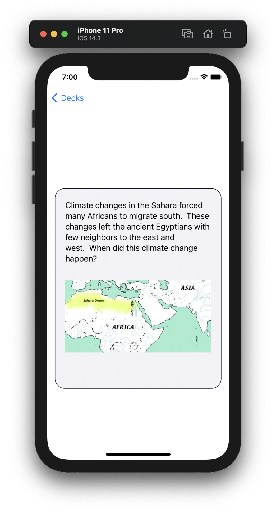
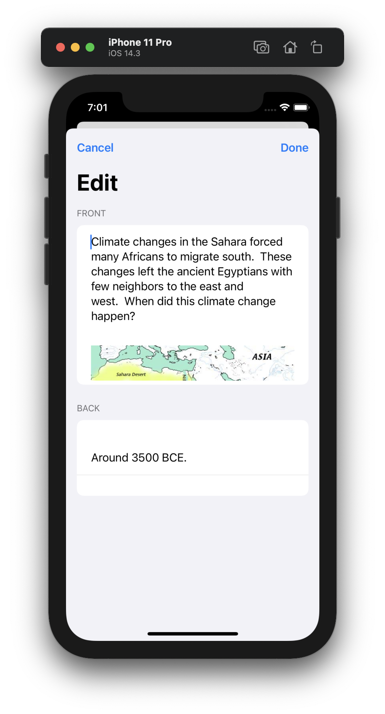

# Swanki

Swanki is a flashcard program written in SwiftUI that works natively with Anki `*.apkg` files.

My conclusions after getting the app this far:

1. SwiftUI is cool but not mature / stable enough to adopt yet, even for personal projects
2. Anki's internals are kind of cryptic. If I was to build a "real" flashcard / spaced repetition product, I wouldn't use Anki's formats natively. (Importing / exporting Anki is another story.)